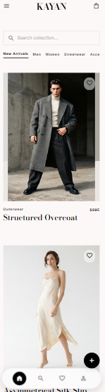
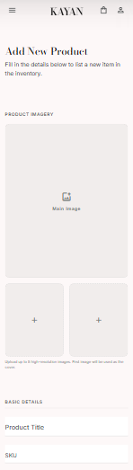

# Local Brand 🛍️

A modern, feature-rich Flutter e-commerce application showcasing a complete product management system with clean architecture, beautiful UI, and seamless API integration.


---

## ✨ Features

### 🏪 **Product Discovery**
- **Real-time API Integration** — Fetches products from [FakeStore API](https://api.escuelajs.co/api/v1/products)
- **Smart Caching** — Prevents duplicate fetches with intelligent state management
- **Loading States** — Elegant skeleton loaders and progress indicators
- **Error Handling** — Graceful fallbacks with user-friendly messages

### 🛒 **Shopping Experience**
- **Product Catalog** — Browse products with images, categories, and pricing
- **Favorites System** — Heart toggle with persistent local state
- **Product Details** — Full-screen view with descriptions, fabric care, and specifications
- **Category Filtering** — Horizontal scrolling category chips

### ➕ **Product Management (Admin)**
- **Add New Products** — Comprehensive form with validation
- **Image Placeholders** — Main image + sub-image upload UI
- **Variant Support** — Sizes, colors, SKU, pricing tiers
- **Inventory Tracking** — Stock quantity management
- **Form Validation** — Real-time validation with helpful error messages

### 🎨 **Design System**
- **Custom Theme** — Light theme with carefully crafted color palette
- **Typography** — Google Fonts (Bodoni Moda + Inter) for elegant readability
- **Spacing System** — Consistent 8px base spacing scale
- **Border Radius** — Unified radius tokens for cohesive rounded corners
- **Glassmorphism** — Modern frosted glass navigation bar

### 🧭 **Navigation & Routing**
- **Named Routes** — Type-safe route definitions
- **Bottom Navigation** — Persistent tab bar with home/profile
- **Deep Linking Ready** — Route generator pattern for scalability

---

## 🏗️ Architecture

```
lib/
├── api/
│   └── product_service.dart      # HTTP client & API integration
├── core/
│   ├── routing/
│   │   ├── app_router.dart       # Route generator
│   │   └── routes.dart           # Route name constants
│   ├── theme/
│   │   ├── app_color.dart        # Color palette
│   │   ├── app_spacing.dart      # Spacing tokens
│   │   ├── app_radius.dart       # Border radius tokens
│   │   ├── app_typography.dart   # Text styles
│   │   └── app_theme.dart        # ThemeData composition
│   ├── utils/
│   │   ├── app_validators.dart   # Form validation logic
│   │   └── extenstions/
│   │       └── capitalized.dart  # String extensions
│   └── widgets/
│       ├── app_bar.dart          # Custom app bar
│       ├── nav_bar.dart          # Glassmorphism nav bar
│       └── nav_item.dart         # Nav bar item component
├── models/
│   └── product_model.dart        # Product data model + dummy data
├── pages/
│   ├── home_screen.dart          # Product listing (main screen)
│   ├── product_details.dart      # Product detail view
│   ├── add_product_screen.dart   # Admin product creation
│   ├── login_screen.dart         # Auth (placeholder)
│   ├── signup_screen.dart        # Auth (placeholder)
│   └── splash_screen.dart        # App entry animation
├── widgets/
│   ├── category_card.dart        # Product card component
│   ├── form_field.dart           # Reusable form input
│   ├── selectable_box.dart       # Chip selection component
│   └── sub_image.dart            # Sub-image placeholder
├── home.dart                     # Root scaffold with nav
└── main.dart                     # App entry point
```

---

## 🚀 Getting Started

### Prerequisites
- **Flutter SDK** ≥ 3.11.4
- **Dart SDK** ≥ 3.0
- Android Studio / VS Code with Flutter extensions
- Chrome (for web) or Android/iOS device/emulator

### Installation

```bash
# Clone the repository
git clone https://github.com/yourusername/local_brand.git
cd local_brand

# Install dependencies
flutter pub get

# Run on available device
flutter run
```

### Platform Setup

| Platform | Command |
|----------|---------|
| **Android** | `flutter run -d android` |
| **iOS** | `flutter run -d ios` |
| **Web (Chrome)** | `flutter run -d chrome` |
| **Windows** | `flutter config --enable-windows-desktop && flutter create . && flutter run -d windows` |

---

## 📦 Dependencies

| Package | Version | Purpose |
|---------|---------|---------|
| `flutter` | SDK | Core framework |
| `http` | ^1.6.0 | API requests |
| `google_fonts` | ^6.2.1 | Typography |
| `cupertino_icons` | ^1.0.8 | iOS-style icons |

**Dev Dependencies:**
- `flutter_test` — Unit/widget testing
- `flutter_lints` — Static analysis

---

## 🎯 Key Implementation Details

### API Service (`lib/api/product_service.dart`)
```dart
class ApiService {
  Future<List<ProductModel>> getProduct() async {
    const apiUrl = 'https://api.escuelajs.co/api/v1/products';
    final response = await http.get(Uri.parse(apiUrl));
    
    if (response.statusCode == 200) {
      final data = jsonDecode(response.body) as List;
      return data.map((json) => ProductModel.fromJson(json)).toList();
    }
    throw Exception('Failed to load products');
  }
}
```

### Product Model (`lib/models/product_model.dart`)
Maps API response to typed model with:
- `id`, `name`, `image`, `category`, `price`
- `description`, `fabricCare` (computed defaults)
- Safe JSON parsing with null checks

### State Management
- **Local State** — `setState` for simple screens (favorites, loading)
- **No external state lib** — Keeps bundle size minimal
- **Ready for Riverpod/Bloc** — Clean separation for scaling

---

## 🎨 Theming System

### Colors (`lib/core/theme/app_color.dart`)
```dart
class KayanColors {
  static const primary = Color(0xFF1A1A2E);
  static const secondary = Color(0xFF16213E);
  static const accent = Color(0xFFE94560);
  static const surface = Color(0xFFFFFFFF);
  // ... semantic color roles
}
```

### Spacing (`lib/core/theme/app_spacing.dart`)
```dart
class KayanSpacing {
  static const xs = 4.0;
  static const sm = 8.0;
  static const md = 16.0;
  static const lg = 24.0;
  static const xl = 32.0;
  static const containerMargin = 20.0;
}
```

---

## 🧪 Testing

```bash
# Run unit/widget tests
flutter test

# Run with coverage
flutter test --coverage

# View coverage report (requires lcov)
genhtml coverage/lcov.info -o coverage/html
```

---

## 📱 Screenshots

| Home Screen | Product Details | Add Product |
|-------------|----------------|-------------|
|  |  |  |

*Add screenshots to `docs/screenshots/` to showcase your app*

---

## 🗺️ Roadmap

- [ ] **Cart & Checkout** — Full shopping cart with persistence
- [ ] **User Authentication** — Firebase Auth integration
- [ ] **Wishlist Sync** — Cloud-firestore backed favorites
- [ ] **Push Notifications** — Order updates & promotions
- [ ] **Admin Dashboard** — Product CRUD management panel
- [ ] **Dark Mode** — Full theme switching support
- [ ] **Localization** — Multi-language (AR/EN)
- [ ] **Unit Tests** — 80%+ coverage target
- [ ] **CI/CD** — GitHub Actions for build & deploy

---

## 🤝 Contributing

1. Fork the repository
2. Create your feature branch (`git checkout -b feature/amazing-feature`)
3. Commit your changes (`git commit -m 'Add amazing feature'`)
4. Push to the branch (`git push origin feature/amazing-feature`)
5. Open a Pull Request

### Code Style
- Follow [Effective Dart](https://dart.dev/guides/language/effective-dart)
- Run `flutter analyze` before committing
- Format with `dart format .`

---

## 📄 License

Distributed under the MIT License. See `LICENSE` for more information.

---

## 🙏 Acknowledgments

- [FakeStore API](https://fakestoreapi.com/) — Product data
- [Google Fonts](https://fonts.google.com/) — Typography
- [Flutter Team](https://flutter.dev/) — Amazing framework
- [Unsplash](https://unsplash.com/) — Placeholder imagery

---

## 📞 Contact

**Your Name** — [@yourhandle](https://twitter.com/yourhandle) — email@example.com

Project Link: [https://github.com/yourusername/local_brand](https://github.com/yourusername/local_brand)

---

<div align="center">

**Made with ❤️ using Flutter**

⭐ Star this repo if you found it helpful!

</div>